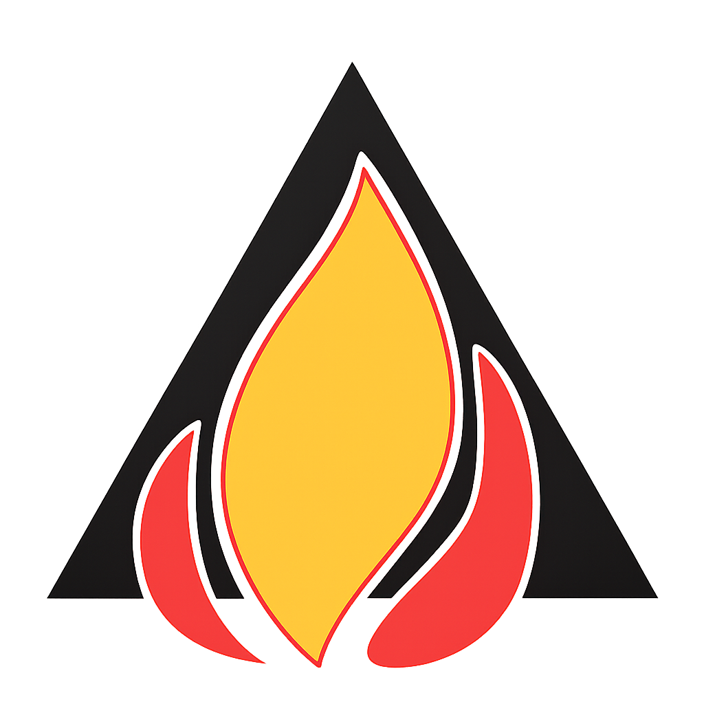

# Fire Triangle - Fire Safety Solutions Website



A professional website for Fire Triangle, a leading fire safety services provider in Sri Lanka, offering fire protection systems, equipment, and safety training.

## Table of Contents
- [Features](#features)
- [Technologies Used](#technologies-used)
- [Installation](#installation)
- [Project Structure](#project-structure)
- [Components](#components)
- [Customization](#customization)
- [Deployment](#deployment)
- [License](#license)

## Features

- **Modern Responsive Design**: Fully responsive across all devices
- **Professional UI/UX**: Clean, safety-focused interface with red/white theme
- **Key Sections**:
  - Hero banner with emergency contact
  - Services & Products showcase
  - Client success stories
  - Recent projects gallery
  - Training programs
  - Contact/scheduling system
- **Performance Optimized**: Fast loading with lazy loading and optimized assets
- **SEO Friendly**: Proper meta tags and semantic HTML

## Technologies Used

- **Frontend**:
  - React.js (v18+)
  - Styled Components
  - Framer Motion (animations)
  - React Icons
  - React Router (v6+)

- **Build Tools**:
  - Vite (or Create React App)
  - npm/yarn

## Installation

1. Clone the repository:
   ```bash
   git clone https://github.com/your-username/fire-triangle-website.git
   cd fire-triangle-website